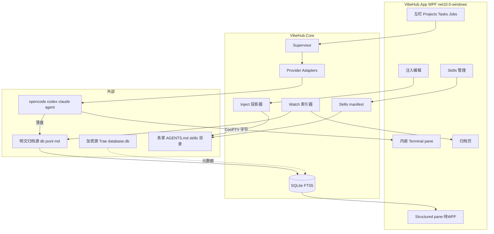

# 架构总览：三平面 + 双轨终端

> 编写模型: Claude Fable 5 (Cursor Agent) · 2026-07-21

## 全景



## 三平面职责边界

| 平面 | 对象 | 能力 | 明确禁止 |
|---|---|---|---|
| **A 调度** | 开放 CLI（OpenCode/Codex/Claude/agent） | spawn / resume / kill；ConPTY 内嵌 | 调度封闭 Work App |
| **B 归档+注入** | 本机所有可读会话/记忆数据 | 只读索引展示；写 Hub sink 并投影到「会被加载的文件」 | 解密、写各家私有 DB、注入进程 |
| **C Skills** | SKILL.md 生态 | 中央库下载；按工具 copy + manifest 开关 | 共享目录（跨读泄漏）、替各家跑 skill runtime |

## 双轨终端（核心设计决策）

同一 job 两路视图，数据源分离：

1. **Terminal pane** = ConPTY 原始字节流 → 内嵌终端控件。不做任何解析，TUI 保真。
2. **Structured pane** = 旁路 tail 各家**磁盘 transcript/DB**，解析成 canonical 消息渲染。

理由（业界验证：cc-remote-term、Hermes dashboard 同构）：

- 剥 ANSI 重排 TUI 画布不可靠（alt-screen、光标跳转、重绘）；
- 各家本来就把完整结构化历史落盘，旁路读是零风险且完整（终端视口会截断长回复，transcript 不会）。

## Canonical 数据模型

```
Project   { id, rootPath, displayName }
Task      { id, projectId, title, status, notes }        // 用户主索引，自建
Session   { id, taskId?, provider, providerSessionId, cwd, startedAt, title }
Message   { id, sessionId, role, content, ts, model? }
ToolCall  { id, messageId, name, argsJson, resultJson?, status }
Job       { id, sessionId?, provider, pid, state, exitCode? }
```

- `Task` 是自己的组织单位；各家原生 task 概念只作 imported evidence。
- Session 树形分支（Pi/Codex fork）用 `Message.parentId?` 预留，MVP 先线性。

## 解决方案结构

```
VibeHub.sln                    # net10.0-windows
  src/VibeHub.App/             # WPF 主窗口；终端 Host 在此
  src/VibeHub.Core/            # Supervisor, Adapters, Watch, Inject, Skills, Idx
  src/VibeHub.Terminal/        # IPseudoTerminal + 选定控件适配
  tests/VibeHub.Core.Tests/    # mock launcher/PTY，禁真进程
  docs/                        # 本文档树
```

技术底座：CommunityToolkit.Mvvm（源生成）、Microsoft.Extensions.Hosting/DI、Microsoft.Data.Sqlite + FTS5、Markdig（Structured pane 渲染）。

## 关键决策记录（ADR 摘要）

| # | 决策 | 理由 |
|---|---|---|
| D1 | WPF 而非 WinUI/Avalonia | 用户强制 .NET 10 + WPF；终端控件生态（EasyWindowsTerminalControl / WebView2）在 WPF 最全 |
| D2 | 终端主选 EasyWindowsTerminalControl，备选 WebView2+xterm | 见 [01-terminal-embedding.md](01-terminal-embedding.md)；IME 实测定生死 |
| D3 | Structured pane 读磁盘而非解析 PTY | 上文双轨理由 |
| D4 | 归档首源 OpenCode db | 本机唯一大体量明文源（327 会话），做完立刻有内容 |
| D5 | 注入用管理块合并 | 目标文件（如本机 `~/.codex/AGENTS.md` 8.7KB 手写内容）不可覆盖 |
| D6 | Skills 全走 copy 不用 junction | Claude junction 多个未修 bug；Codex 旧路径跳过 symlink |
| D7 | Trae 会话库判红放弃 | 两库文件头实测为随机字节（SQLCipher 类加密） |
