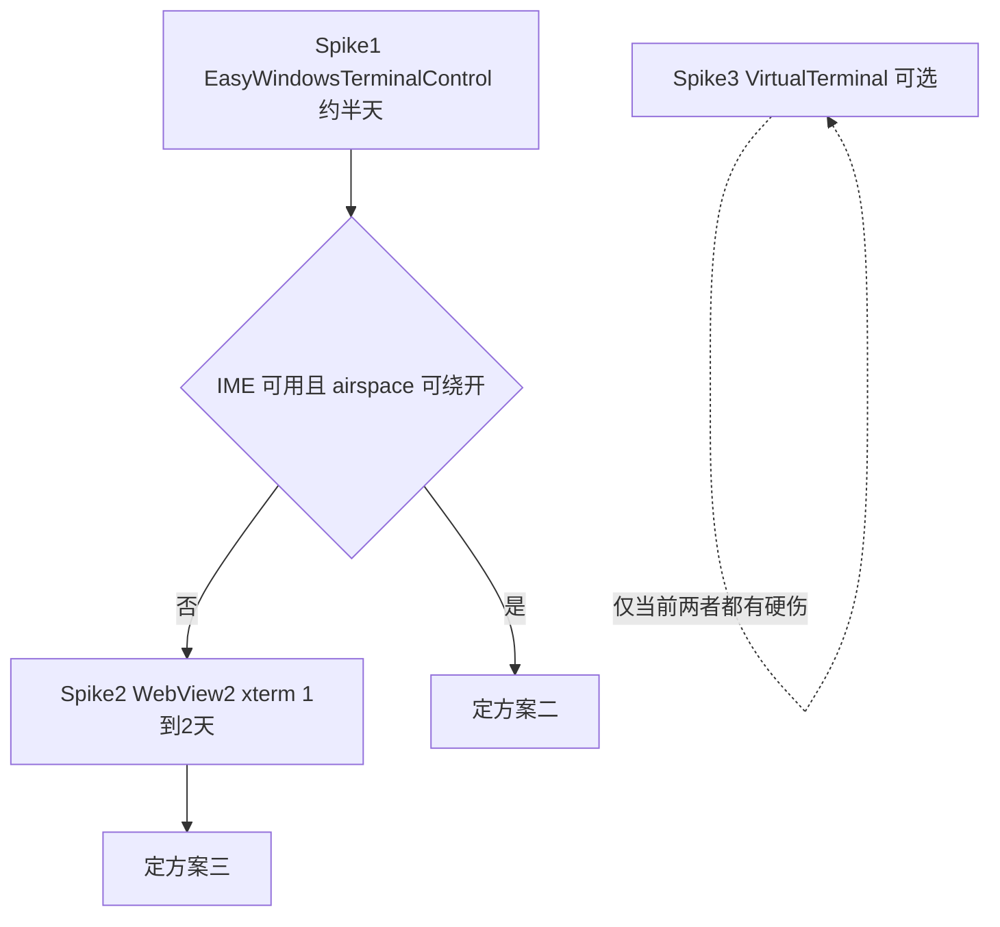

# WPF 内嵌终端选型

> 编写模型: Claude Fable 5 (Cursor Agent) · 2026-07-21

结论：**主选 EasyWindowsTerminalControl，备选 WebView2 + xterm.js；Rikitav/VirtualTerminal 仅观察**。ConPTY 封装主选 `TermPTY`（随主选控件自带），备选抄 CodeShellManager 的 `PseudoTerminal.cs`；Pty.Net 不采用（无公开 NuGet 包、不维护）。

## 候选对比（2026-07 调研）

| 维度 | ① [VirtualTerminal](https://github.com/Rikitav/VirtualTerminal) | ② [EasyWindowsTerminalControl](https://github.com/mitchcapper/easywindowsterminalcontrol) | ③ WebView2 + xterm.js（[CodeShellManager](https://github.com/umage-ai/CodeShellManager) 模式） |
|---|---|---|---|
| NuGet | `VirtualTerminal` 1.7.0，下载量极低 | `EasyWindowsTerminalControl` 1.0.38（~5k 下载），依赖 `CI.Microsoft.Terminal.Wpf` + `Microsoft.Windows.Console.ConPTY` | `Microsoft.Web.WebView2` 官方；xterm.js 静态资源 |
| 维护 | 单人 4 star，2026-01 起，API 剧烈重构 | 活跃，明确兼容 `net10.0-windows`；底层 WT WPF 控件官方未 productize | xterm.js 21k star；参考实现为 .NET 10 WPF、MIT |
| TUI 完整度 | 引擎有 alt-screen，但复杂 TUI 未验证；疑无鼠标上报 | **最高**：WT 渲染内核，24-bit、鼠标、alt-screen、Win32 Input Mode | 最高级别（VS Code 同款） |
| 截流 | 自己包 `ITerminalSession` | **现成**：`LogConPTYOutput` + `GetConsoleText(stripVTCodes)` 双流；`InterceptOutput/InputTo…` 委托 | 自建 Bridge，全流经手 |
| 中文 IME | 大概率没做 TSF | conhost TSF 有，但 WPF island 场景官方源码注释警告有坑，**需实测** | **最有把握**（helper textarea 路线；xterm.js ≥2026-03 修复候选窗定位 #5454） |
| 主要风险 | 太新、无用户基础 | HwndHost airspace：WPF 元素不能叠终端上方（Popup/ContextMenu 可） | 每 session 一个 WebView2 实例内存偏重；键盘/焦点桥接自维护 |

## ConPTY 封装

- **主选**：`TermPTY`（EasyWindowsTerminalControl 内置，可独立 `new` + `Start()` 当 headless PTY 用；自带双向 intercept、binary writer）。
- **备选**：自 P/Invoke，以 CodeShellManager `PseudoTerminal.cs`（约 260 行，MIT）为样板。已踩平的坑：HPCON 直传 `UpdateProcThreadAttribute`；`CreatePseudoConsole` 后关 PTY 侧管道句柄；Windows 异步管道读会卡死 → 阻塞 `Read()` 放线程池；非 shell 命令包一层 `powershell -NoExit`；Job Object 保证子进程树随 PTY 销毁。
- **不采用**：microsoft/vs-pty.net（从未上 nuget.org，实质停维护）。

## Spike 决策流程

### Spike 1 验收点（claude / opencode 实测）

1. alt-screen TUI 完整渲染：输入框、spinner、diff、`/` 菜单不错位；退出无残影
2. 键盘：方向键、Tab、Esc、Ctrl+C、Shift+Enter；`Win32InputMode` 开/关各测
3. 鼠标：opencode 内点击/滚轮被 TUI 接收
4. **中文 IME（生死关卡）**：微软拼音 + 搜狗组合输入，候选窗位置、丢字、崩溃
5. 截流：原始 VT 与 strip 文本双流可拉取
6. airspace：终端上叠半透明 Border 验证遮挡；Popup 验证弹层可用

### Spike 2 验收点（追加）

- xterm.js 用 ≥2026-03 的 6.x（含 IME 修复）
- 加速键经 `PreviewKeyDown` 桥接后全局快捷键与 TUI 内快捷键不打架
- 4 个并发 claude session 的内存与大输出吞吐
- PTY 早于页面加载时首屏输出不丢（NavigationCompleted 前缓冲）

## UI 设计约束（由 airspace 推导）

无论 ②③，终端区域上方都不能叠普通 WPF 元素。因此：

- toast/命令面板用 `Popup`（独立 HWND）或放在终端区域外
- 终端内提示可用 VT 序列注入（方案 ② `WriteToUITerminal`）
- 布局用 Grid 分栏而非 overlay
