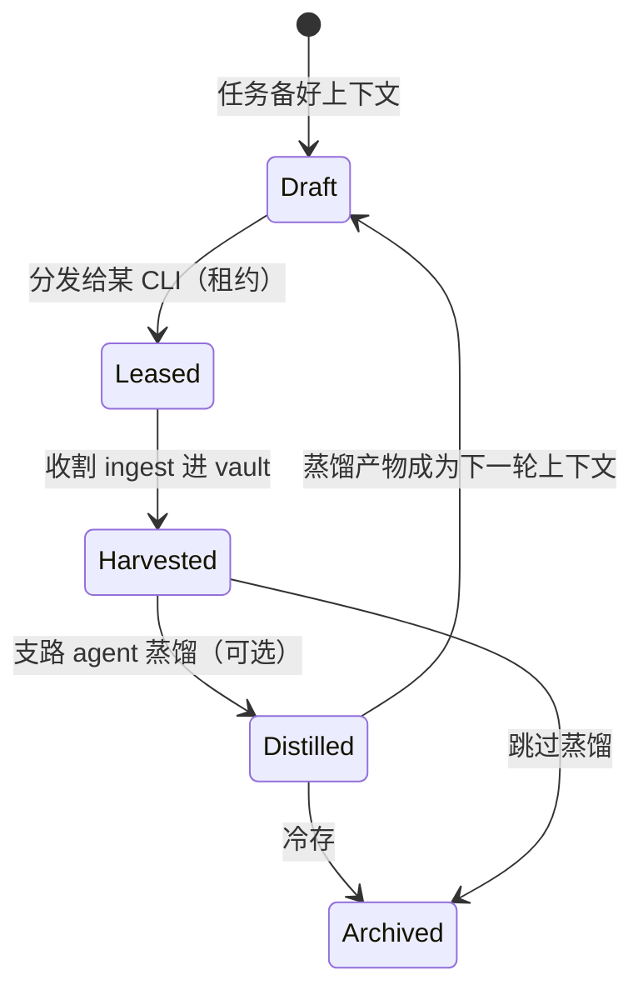
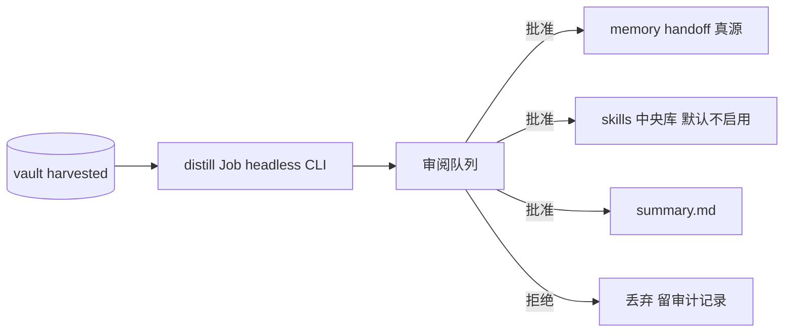

# 会话生命周期：租约、收割、真归档、迁移与蒸馏

> 编写模型: Claude Fable 5 (Cursor Agent) · 2026-07-21

核心理念（所有权反转）：**项目/工作区归 vibe-hub；CLI 是临时执行器**。工具侧的一切状态都是 Hub 的投影或缓存，可重建、可回收。

## 生命周期状态机



| 状态 | 含义 | 数据位置 |
|---|---|---|
| Draft | context/handoff 备好，投影就绪 | Hub 真源 |
| Leased | 正在某 CLI 里跑（内嵌终端或 headless） | 工具侧 = **临时缓存** |
| Harvested | 已 ingest：raw 副本 + canonical 解析入 vault，消息数/哈希核对通过 | vault |
| Distilled | summary / memory 建议 / skill 草案已产出并过审 | vault + 真源 |
| Archived | 冷存，可检索回放 | vault |

## Vault 布局（真归档）

```
<vault>/                              # 可配置，默认 %USERPROFILE%\vibe-hub-vault
  projects/<projectId>/
    project.json                      # 根路径、任务、租约记录
    memory.md  handoff.md  context.md # 注入真源（F4 的 sink 收编于此）
    sessions/<sessionId>/
      raw/                            # 原始保真：jsonl 全文 / db 行导出 / 捕获流
      canonical.jsonl                 # 统一模型（Message/ToolCall）
      summary.md                      # 蒸馏产物
      meta.json                       # provider、resume 令牌、生命周期状态、哈希
    skill-drafts/                     # 蒸馏出的 SKILL.md 草案（待审）
  skills/                             # 中央技能库（F5）
  index.db                            # SQLite FTS5 全文索引
```

与「旁路索引」的本质区别：**vault 是复制进来的独立副本**——工具卸载、清数据、换机，归档不受影响。vault 全部是文件 + 单个 SQLite，可整目录拷走（手动跨机迁移即搬 vault）。

## Ingest（收割）规则

1. 触发：Job 结束自动 / 会话卡片手动 / 定时扫描增量
2. 按 `TranscriptSource` 三型执行（见 [02-dispatch-adapters.md](02-dispatch-adapters.md)）：FileTail 源复制原文件；SqliteSnapshot 源导出相关行；CapturedStream 源本身已在 Hub 手里
3. 校验：canonical 解析成功 + 消息计数/内容哈希核对 → 标记 Harvested；失败保留 raw、标记 `ingest-error`
4. **工具侧清理（默认关闭）**：仅对已核实 Harvested 的**文件型**会话（Codex/Claude jsonl）提供「移入回收站」选项；OpenCode 共享 db 与一切加密源永不清理

## 会话迁移（诚实边界）

各家 transcript 互不兼容、session id 由各家自铸，**raw 移植不可行也不承诺**。三档能力：

| 场景 | 做法 | 保真度 |
|---|---|---|
| 同工具续跑 | `meta.json` 存 resume 令牌 → 原生 resume | 完整 |
| 同工具跨机 | 搬 vault + 把 raw 放回原生路径（Codex/Claude jsonl 可续 resume；OpenCode 整库搬） | 完整 |
| **跨工具** | **语义迁移**：蒸馏 summary+handoff → 注入投影 → 目标工具开新会话 | 上下文级 |

UI：迁移向导 = 选会话 → 选目标工具 → 生成/复用 summary → 投影 → 一键开新 Job。

## 支路 Distiller Agent（蒸馏）



- **实现**：Supervisor 的 `distill` 类型后台 Job，headless 调现有 CLI（`codex exec --json` / `claude -p --output-format stream-json` / `opencode run --format json`），prompt 模板 + canonical 会话切片作输入；不自研 runtime（vision 非目标）
- **三类产出**：① 精简会话 summary；② memory/handoff 增量建议（diff 形式）；③ SKILL.md 草案
- **人审闸门**：一切产物先进审阅队列，批准才落真源/技能库；拒绝留审计。防 agent 静默污染记忆
- **成本**：可指定便宜模型；跑前显示输入 token 预估；批量模式限额
- 长会话超窗：按轮次分片 map-reduce（先分段摘要再汇总），MVP 可只支持「最近 N 轮」

## 对既有设计的修订

- F4 注入的 sink 目录收编进 vault（`projects/<id>/` 下），投影机制不变（管理块合并）
- 归档页从「只读镜像」升级为「vault 浏览器」：生命周期徽章、Harvest/蒸馏/迁移按钮、审阅队列入口
- Job 类型扩展：`interactive`（内嵌终端）、`headless`（stream 捕获）、`distill`（蒸馏）
- ADR 增补：D8 所有权反转（vault 为真源）；D9 蒸馏复用 headless CLI + 人审闸门；D10 跨工具只做语义迁移
