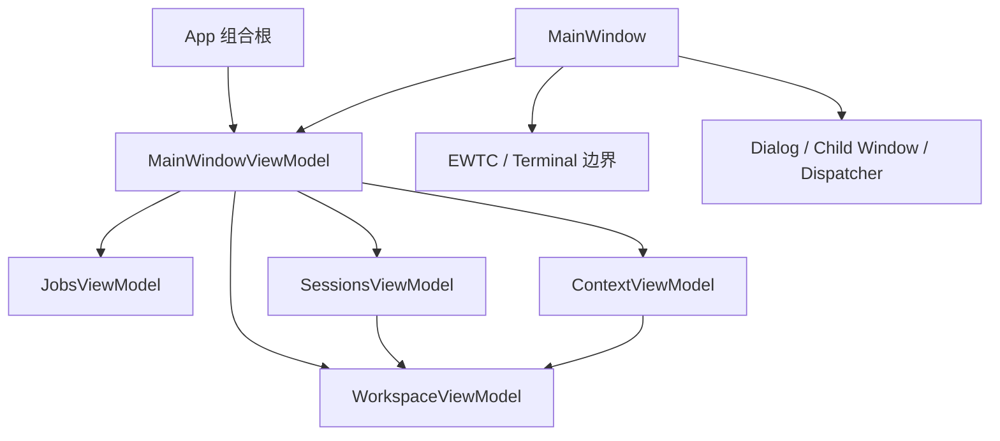

# spec-009：MainWindow 稳定 MVVM 重构

> model: gpt-5.6-sol | reasoning_effort: high | model_date: 2026-07-24

> 状态：稳定设计已冻结，待分阶段实现。

## 1. 背景与问题

当前 `MainWindow.xaml.cs` 有 1222 行，直接持有 Store、Provider Adapter、Supervisor、Archive、Vault、Distill、Inject、Skills、Git、设置、EWTC 控件和页面导航状态；`MainWindow.xaml` 有 846 行、47 个 `Click=` 与 3 个 `SelectionChanged=` 入口。现有 `MainWindowViewModel` 只有集合和展示属性，没有命令、异步状态或生命周期管理，App 层也没有测试项目。

问题不是行数本身，而是三类边界混在一起：

1. WPF/EWTC 交互：控件生命周期、焦点、键鼠、Dialog、Dispatcher。
2. 应用编排：选择项目/provider、Start/Resume/Kill、Archive、Vault、Inject、Skills。
3. 后台状态：取消、忙碌、错误、结果防倒灌和资源释放。

重构只迁移后两类。已经接真的功能不得退回 Mock，也不得借重构改变数据格式、Core 契约或用户路径。

## 2. 目标

- `MainWindow` 只承担 Shell、WPF/EWTC、Dialog 与 UI 线程边界。
- 业务状态和用户动作由可测试的 ViewModel 与现有 Core 服务承担。
- 每个阶段独立可构建、可测试、可手工验收、可回滚。
- 保留现有 Archive 过期结果保护、真实进程取消、独立 Vault 连接和终端交互行为。
- 使用项目已有的 `CommunityToolkit.Mvvm`；不新增运行时依赖。

## 3. 明确不做

- 不一次性重写 `MainWindow`，不以“零 code-behind”为目标。
- 不引入 DI 容器、导航框架、消息总线或“一接口一实现”。
- 不更换 WPF、HandyControl 或 EasyWindowsTerminalControl。
- 不把 WPF/EWTC 类型放进 ViewModel。
- 不为减少文件行数提前拆 UserControl；只有出现独立复用或独立生命周期时再拆。
- 不在同一阶段同时做功能开发、数据库迁移、路径变更或 Core 语义修改。
- 不用 LOC 降幅作为验收条件，避免为数字搬运复杂度。

## 4. 稳定目标结构

`MainWindowViewModel` 是轻量 Shell，只组合四个子 ViewModel 并维护 `CurrentPage`。它不成为新的上帝类。

### 4.1 ViewModel 职责

| 类型 | 唯一职责 | 主要状态与命令 |
| --- | --- | --- |
| `MainWindowViewModel` | Shell 组合与导航 | `CurrentPage`、四个子 ViewModel、导航命令 |
| `WorkspaceViewModel` | 当前工作上下文 | 当前项目、工作目录、provider、Projects、Tasks、Changes、设置；刷新、选项目、建/推进任务、保存设置 |
| `JobsViewModel` | Job 与独立 Agent 任务 | Jobs、SelectedJob、Agents、Activity、运行状态/输出；Start、Resume、Kill、Run、Cancel |
| `SessionsViewModel` | Archive、消息与 Vault 工作流 | Sources、Sessions、Messages、VaultResults、选择状态；Refresh、Load、Harvest、Distill、Search |
| `ContextViewModel` | Memory/Handoff、Inject 与 Skills | 编辑内容、Skills、所选工具/源、状态；Save、Project、Remove、Install、Enable、Disable、Repair |

依赖规则：

- `SessionsViewModel`、`ContextViewModel` 可读取 `WorkspaceViewModel` 的当前项目/provider/工作目录。
- `JobsViewModel` 不依赖 `SessionsViewModel`；Resume 接收显式 session 参数。
- 子 ViewModel 之间不得互相订阅形成环。
- 只有确有外部副作用且测试需要替身的现有服务边界才可抽象；禁止批量制造 passthrough 接口。

### 4.2 必须留在 View 的允许清单

以下内容留在 `MainWindow.xaml.cs` 是正确边界，不计为 MVVM 未完成：

- `EasyTerminalControl` 创建、映射、挂载到 `TerminalHost.Child`、切换与 Focus。
- `_pendingTerminals`、`_terminalsByJob`、`_activeJobId`。
- `OnTerminalCreated`、`OnJobLaunched`、`ShowTerminal`。
- terminal 键盘、鼠标、焦点、selection 与中文 IME 相关事件。
- `Dispatcher` 切回 UI 线程，以及 `DispatcherTimer` 的触发与释放。
- `OpenFileDialog`、文件夹选择、`MessageBox`、Explorer、`ReviewWindow`、`MigrationWizardWindow`。
- Window owner、关闭事件、控件级视觉交互。

Dialog 只负责获得用户输入或呈现结果，随后调用 ViewModel 命令；不得继续承载服务编排。

### 4.3 UI 类型隔离

ViewModel、命令参数和返回值不得出现：

- `Window`、`Control`、`Brush`、`DispatcherTimer`
- `EasyTerminalControl`、`IPseudoTerminal`
- 任何通过 `x:Name` 获得的控件

现有 `MessageRow` 的 `Brush` 改为纯状态值，颜色由 XAML `DataTrigger`/资源决定。优先使用 WPF 原生绑定和 Toolkit 命令，不新增 converter/behavior 框架。

## 5. 组合根与生命周期

### 5.1 组合根

移除 `App.xaml` 的 `StartupUri`，由 `App.OnStartup` 手工构造已有 concrete services、四个子 ViewModel、`MainWindowViewModel` 和 `MainWindow`。当前规模不引入 DI 容器。

`MainWindow` 只直接接收：

- `MainWindowViewModel`
- 终端创建确实需要的 launcher/supervisor 边界

其余 Store、Archive、Vault、Inject、Skills、Git 服务不再由窗口持有。

### 5.2 所有权

- `App`：应用级服务和 `IDisposable` 的最终释放。
- 子 ViewModel：自己的 `CancellationTokenSource`、命令状态和事件退订。
- `MainWindow`：EWTC 控件、DispatcherTimer、终端事件订阅和窗口级资源。
- Supervisor 事件先由 View 在 Dispatcher 上接收，再把纯数据转交给 `JobsViewModel`；不得把 Dispatcher 注入 ViewModel。

窗口关闭时按“停止接收事件 → 取消 ViewModel 操作 → 释放终端/定时器 → 释放应用服务”的顺序收口。

## 6. 异步与状态契约

### 6.1 命令规则

- 业务入口使用 `[RelayCommand]` 或 `[AsyncRelayCommand]`；除 WPF 事件壳外禁止 `async void`。
- 同一动作统一暴露 `IsBusy`、`Status`、`Error`；开始时清旧错误，结束时在 `finally` 清 Busy。
- `OperationCanceledException` 表示取消，不写入 `Error`，也不展示成功。
- 命令可执行条件由选择状态和 Busy 状态决定，避免在 handler 内静默返回。

### 6.2 线程规则

- 后台工作只返回 POCO/record；`ObservableCollection` 只在捕获的 UI 同步上下文更新。
- Archive 的 source、entry、version/identity guard 原样保留：旧请求完成后不得覆盖新选择。
- `IArchiveSource` 目前只保证调用前后协作式取消，不宣称可以中断正在执行的同步源读取。
- `ProcessHeadlessRunner` 继续传递真实 token 并终止进程树。
- 每个后台 Vault 操作创建独立 `VaultIndex`/SQLite 连接，不跨线程复用。
- 不允许为了“异步化”把整个命令体无差别包进 `Task.Run`；只把已有同步 I/O 边界放入后台。

## 7. 迁移计划

每个 Phase 单独实现、验证和提交。当前阶段未过门禁时不得进入下一阶段。

### Phase 0：基线、测试与组合根

- 新增 `tests/VibeHub.App.Tests`，目标框架为 `net10.0-windows`，引用 App/Core，沿用现有 xUnit 与 NSubstitute 版本。
- 记录并测试当前 Shell 组合、页面状态和既有纯 ViewModel 行为；Archive 防倒灌、取消与错误测试随对应行为迁移时加入，避免为尚未迁移的 WPF 私有逻辑制造测试专用抽象。
- 建立 `App.OnStartup` 手工组合根；窗口行为保持不变。
- 先定义四个子 ViewModel 的空壳和所有权，不迁业务。

门禁：测试不启动真实 WPF 窗口、ConPTY 或 CLI；`dotnet test` 与 Release build 通过。

### Phase 1：Workspace 基座

- 先迁 `WorkspaceViewModel`：当前项目、工作目录、provider、Projects、Tasks、Git Changes、Settings。
- 删除 `WorkspaceName`、`BranchName`、`ActiveTask`、`ContextUsage` 等硬编码展示值；未接真的指标继续明确标为待办，不造假。
- 文件夹选择只把结果传给 ViewModel。

门禁：默认值、项目切换、任务流转、设置持久化和 Git 不可用路径测试通过；后续子 ViewModel 能从同一实例读取当前工作上下文。

### Phase 2：Context 叶节点

- 迁 `ContextViewModel`：Memory/Handoff、Inject、Skills。
- Browse/MessageBox 留在 View，命令只接收纯路径、工具名和内容。
- 保留底层真实异常摘要，失败不得清空编辑内容或写虚假成功。

门禁：保存/投影/拆除、安装/启用/停用/修复的成功和失败测试通过；现有 `InjectSkillsTests` 继续通过。

### Phase 3：Sessions 与 Vault

- 迁 `SessionsViewModel`：source/session、Structured、Harvest、Distill、Vault Search。
- 保留后台 I/O、source/session/version guard 和每操作独立 Vault 连接。
- 打开 Review/Migration/Explorer 仍由 View 适配。

门禁：快速切 source/session 的旧结果被丢弃；取消不报错；后台失败解除 Busy；UI 线程不执行 Archive/Vault I/O。

### Phase 4：Jobs 与 Agent

- 迁 `JobsViewModel`：Jobs、Agents、Activity、Start/Resume/Kill、独立 Agent Run/Cancel。
- View 把 Supervisor/launcher 事件转成纯数据交给 ViewModel；ViewModel 不接触 terminal control。
- Job 选择可绑定；真正的终端切换/聚焦仍由 View 响应选择结果。

门禁：命令参数使用当前项目/provider；Run/Cancel 和失败路径测试通过；人工终端 smoke 全通过。

### Phase 5：Shell 收口

- 用 `CurrentPage` 和 XAML Trigger/绑定收口导航。
- 非允许清单内的 `Click`/`SelectionChanged` 收为命令/绑定。
- 将纯 Row/展示模型移到 ViewModels；视觉属性改为 XAML 资源。
- 删除 `MainWindow` 中已经迁移的业务服务字段、业务 `Task.Run` 和重复状态。

门禁：完成定义全部满足，完整测试、Release build 与人工 UI smoke 通过。

## 8. 测试矩阵

| 范围 | 必测行为 |
| --- | --- |
| Shell | 默认页、导航、子 ViewModel 组合 |
| Workspace | 默认 provider/cwd、项目切换、建/推进任务、设置保存、Git 失败 |
| Sessions | 无选择保护、快速切源/会话防倒灌、取消、异常后 Busy 复位、空搜索 |
| Context | 编辑内容保留、Inject 失败、Skill 安装/启停/漂移修复结果 |
| Jobs | Start/Resume/Kill 参数、SelectedJob、Agent Run/Cancel、进程失败 |
| View 手工 smoke | 页面导航、Dialog、Review/Migration、终端快捷键/焦点/IME、关闭释放 |

单元测试不验证 WPF 控件外观，不启动真实 CLI。EWTC/ConPTY 的交互以人工 smoke 为准，不用脆弱的控件 mock 伪装覆盖。

## 9. 完成定义

- `MainWindow` 不再直接依赖 `HubStore`、`ArchiveCatalog`、`Harvester`、`Distiller`、`VaultIndex`、`InjectSink`、`SkillInstaller`、`GitChangesService` 等非终端服务。
- `MainWindow` 中没有业务 I/O、数据库/文件/CLI 编排或业务 `Task.Run`。
- 非允许清单内的 XAML 用户动作使用命令或绑定。
- ViewModel 不引用 WPF、Dispatcher 或 EWTC 类型。
- 所有后台操作具有真实取消或明确的过期结果丢弃策略。
- App 层测试至少覆盖测试矩阵中的状态、选择、取消、错误和 race。
- Core 测试保持通过，App Release build 通过，终端人工 smoke 无回归。
- PENDING 对应 Phase 全部完成后，本 spec 状态改为“已落地并归档”。

## 10. 回滚策略

- 每个 Phase 是一个独立迁移提交；失败只回滚当前 Phase。
- 旧事件处理器可暂时保留为一行 View 适配器，待对应命令和测试通过后再删除。
- 同一提交不同时改变 Core 契约、存储格式或用户路径，因此回滚不需要数据迁移。
- Archive race 或 Terminal 交互一旦回归，立即停止后续阶段并回滚该阶段，禁止通过扩大重构范围规避。
